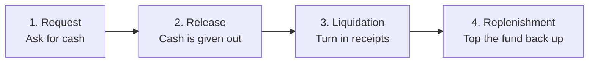
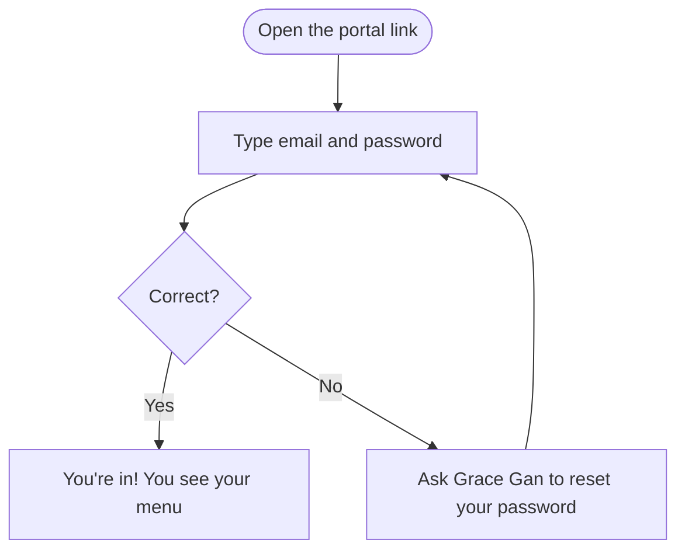
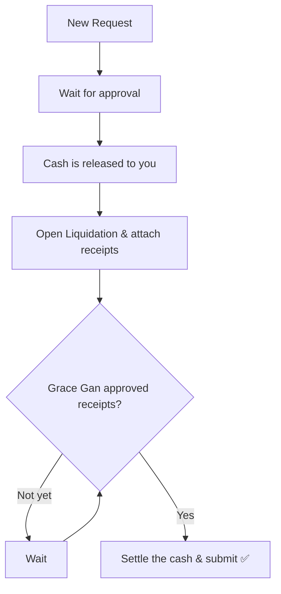
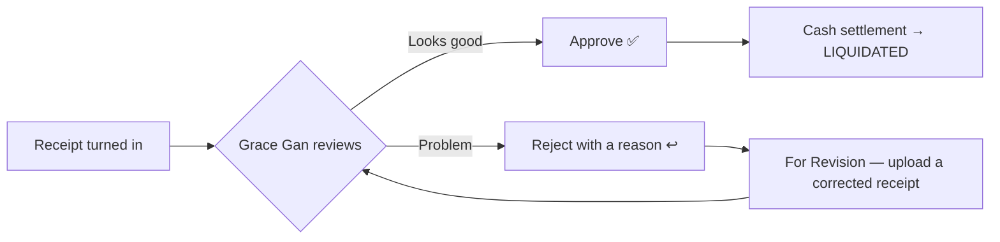

# Petty Cash Portal — Easy User Guide

Welcome! This guide is for **everyone**, even if you have never used the app
before. It explains, in plain words, how to log in and how to do your job.

Take your time. You can't "break" anything — every action is saved, and the
administrator can recover data if needed.

---

## What is this app for?

It keeps track of **petty cash** (the small pool of company money used for
day-to-day expenses). It follows the money through four simple stages:

1. Someone **asks** for cash.
2. The cash is **given out**.
3. Receipts are **turned in** to show how it was spent.
4. The fund is **topped back up** so it's ready for next time.

Here is the whole journey in one picture:

> **Reimbursement** is a separate thing: it's for paying an employee **back**
> for money they already spent from their own pocket. It has its own tab and its
> own rules — see Step 6.

---

## Words you'll see (mini dictionary)

| Word | What it really means |
|------|----------------------|
| **Petty cash** | A small amount of company money for everyday expenses. |
| **Request** | Asking for petty cash before you get it. |
| **Release / Disbursement** | The moment the cash is actually handed out. |
| **Release Ledger** | The list that records every cash release. |
| **Liquidation** | Turning in receipts to prove how the cash was spent. |
| **Receipt / Official Receipt (OR)** | The proof of purchase you attach. |
| **Cash Settlement** | The last step of a liquidation: return the leftover cash, or get paid back if you overspent. |
| **Replenishment** | Refilling the fund back to its normal amount. |
| **Reimbursement** | Paying an employee back for expenses they paid themselves. |
| **Plant** | A site that holds a petty cash fund (Manila, Warner, Disney, RG and Co.). |
| **Branch** | A location inside a plant that spends from the plant's fund (Hasbro, Disney 5, …). |
| **Custodian** | The person who takes care of the cash for a plant. |
| **Aging** | A report that shows advances not liquidated on time. |
| **Dashboard** | The home screen with balances and alerts. |

---

## Step 1 — Log in

1. Open the portal in **Google Chrome** or **Microsoft Edge**:
   **<https://a1plusstarkson.github.io/PCF-Portal/>** — bookmark it.
2. Type your **email** and **password**.
3. Click **Sign In**.

You will only see the buttons and plants that belong to your job — that's normal.

**Forgot your password?** Ask **Grace Gan** to reset it for you — there is no
self-service reset, because the portal cannot send you an email. She sets a new
one straight away and passes it to you. Once you're in, change it to something
only you know using **Change password** at the bottom of the left menu (at least
8 characters).

**To leave**, click **Sign out** at the bottom of the left menu. Give it a second
before closing the tab so your last edit finishes saving.

---

## Step 2 — Find your name and role

Every person has an account. Find yourself in this list to know what you can do
and which plants you'll see.

| Your email | Your name | Your role | Plants you see |
|------------|-----------|-----------|----------------|
| `a1plusadmin@a1plus.com` | Grace Gan | System Administrator (the boss account) | All |
| `accounting@a1plus.com` | Accounting Department | Accounting (full access) | All |
| `finance@a1plus.com` | Finance Department | Finance | All |
| `puradr@a1plus.com` | Pura Barloso | Custodian | Disney + RG and Co. |
| `lita@a1plus.com` | Angelita Bayani | Custodian | Warner |
| `mauwi@a1plus.com` | Maureen Felix | Custodian | Manila |
| `pcfrequestordisney@a1plus.com` | PCF Requestor – Disney | Requestor | Disney |
| `pcfrequestormanila@a1plus.com` | PCF Requestor – Manila | Requestor | Manila |
| `pcfrequestorrgandco@a1plus.com` | PCF Requestor – RG and Co. | Requestor | RG and Co. |

### What "a plant" includes

A plant is the site that **holds the cash**. The branches under it all spend
from that same fund, so being given a plant always gives you the whole family:

| Plant | Branches it covers | Company |
|-------|--------------------|---------|
| **Manila** | A1+, Eurasia, Hasbro, Sitio, Mattel, Perulandia | A1+ Multinational Packaging, Inc |
| **Warner** | Warner | A1+ Multinational Packaging, Inc |
| **Disney** | Starkson (ST), Disney 1, 2, 3, 5, 6, 7, 8, 9 | Starkson Packaging, Inc. |
| **RG and Co.** | RG | RG & Co. Property Management Corporation |

So the **Disney requestor covers all of Starkson Packaging, Inc.**, and the
**Manila requestor covers the A1+ Multinational Packaging branches** under
Manila. Warner keeps its own fund and its own custodian, so it is not part of
the Manila requestor's plant.

Everyone sees the **same four plants** in the sidebar — you just see only the
ones you're assigned. Inside a plant, the row of tabs above the table lets you
narrow to a single branch (for example Disney 5).

> ⭐ This is also why a request filed against a branch like Hasbro or Disney 5
> appears on Accounting's and Finance's dashboard. Before, those records were
> visible only to the person who filed them and their custodian.

---

## Step 3 — Getting around the menu

The left menu is grouped, top to bottom:

| Group | What's inside |
|-------|---------------|
| **Overview** | **Consolidated Dashboard** — every plant you can see, in one view. (Only appears if you have more than one plant.) |
| **One group per plant** (Manila, Warner, Disney, RG and Co.) | That plant's own Dashboard, Petty Cash Requests, Release Ledger, Liquidation, Reimbursement, Replenishment, Transaction History and Reports. |
| **Approvals** | **Approval Module** — one queue covering *all* plants, for everything waiting on a decision. |
| **Monitoring** | **Liquidation Aging** — overdue advances across *all* plants. |
| **Administration** | PCF Documents, Audit Trail, Funds & Master Data, User Management, System Settings. |

Each plant has its **own** set of tabs, so you always know which plant you are
working in — the plant name appears in the page title.

### Sorting any list

Every list in the portal sorts the same way. **Click a column heading** to sort
by it; **click the same heading again** to flip between smallest-first and
largest-first. A small arrow shows which column is doing the sorting:

| Arrow | Meaning |
|-------|---------|
| ▼ | Largest / newest first (for example PCR-2026-0036 at the top) |
| ▲ | Smallest / oldest first (PCR-2026-0001 at the top) |

A few things worth knowing:

- Number columns sort as **numbers**, so 9 comes before 10 — not after it.
- Sorting is applied to whatever your filters and search have already narrowed
  down, and it never changes the data — only the order you see it in.
- It resets when you leave the page. Nobody else's screen is affected.
- Lists that open in a deliberate order (Aging Detail opens worst-overdue
  first; the funds and user lists keep their set-up order) stay that way until
  you click a heading yourself.

This works on Petty Cash Requests, Release Ledger, Replenishment,
Reimbursement, the Approval Module, Transaction History, Liquidation Aging,
Funds & Master Data and User Management — on **every plant**.

---

## Step 4 — What can I do? (simple version)

Think of the roles like this:

- **Requestor** = *"I fill in the forms."* You prepare requests, liquidations and
  reimbursements, but you don't hand out cash or approve anything.
- **Custodian** = *"I hold the cash for my plant."* You approve requests, release
  cash, and refill the fund.
- **Finance** = *"I oversee all plants"* — same as a custodian but for every
  plant, plus master data, the audit trail and the approval queue.
- **Accounting** = *"I run the system"* — everything Finance can do, plus User
  Management and System Settings.
- **System Administrator (Grace Gan)** = *"I have the final say"* — the only one
  who approves receipts, and the only one who can delete data.

Here's the same thing as a checklist:

| Can you… | Requestor | Custodian | Finance | Accounting | Administrator |
|----------|:---------:|:---------:|:-------:|:----------:|:-------------:|
| Create a request | ✅ | ✅ | ✅ | ✅ | ✅ |
| Approve a request | ❌ | ✅ | ✅ | ✅ | ✅ |
| Release cash | ❌ (view only) | ✅ | ✅ | ✅ | ✅ |
| Prepare a liquidation | ✅ | ✅ | ✅ | ✅ | ✅ |
| **Approve receipts** | ❌ | ❌ | ❌ | ❌ | ✅ *(only Grace Gan)* |
| Do a reimbursement | ✅ | ✅ | ✅ | ✅ | ✅ |
| Replenish the fund | ❌ | ✅ | ✅ | ✅ | ✅ |
| See reports & aging | ❌ | ✅ | ✅ | ✅ | ✅ |
| Use the Approval Module | ❌ | ❌ | ✅ | ✅ | ✅ |
| See PCF Documents | ❌ | ✅ | ✅ | ✅ | ✅ |
| See the Audit Trail | ❌ | ❌ | ✅ | ✅ | ✅ |
| Edit master data | ❌ | ❌ | ✅ | ✅ | ✅ |
| Manage users/settings | ❌ | ❌ | ❌ | ✅ | ✅ |
| **Edit a Request No.** | ❌ | ❌ | ❌ | ✅ | ❌ |
| Delete a record | ❌ | ❌ | ❌ | ❌ | ✅ *(only Grace Gan)* |

> ⭐ **Important:** Only **Grace Gan** can approve receipts. A liquidation cannot
> be finished until she has approved every receipt attached to it.

> Grace Gan and Accounting can also **view the portal as another role** to check
> what that person sees. It's a preview only — it grants no extra powers.

---

## Step 5 — How to do your job

Pick the section that matches your role.

### 👩‍💻 If you are a Requestor
You prepare paperwork. You cannot approve or hand out cash.

1. Click **Petty Cash Requests** → **New Request**.
2. Fill in: who it's for, the department, the reason, the amount, and the
   approver. Click **Submit**.
3. Later, when the cash is released, open **Liquidation** to record how it was
   spent and **attach the receipts** (one amount per receipt).
4. Wait for **Grace Gan** to approve the receipts, then submit the liquidation.
5. Use **Transaction History** anytime to check the status of your submissions.

### 💰 If you are a Custodian
You take care of the cash for your plant.

1. Start at the **Dashboard** to see balances and anything that needs attention.
2. In **Petty Cash Requests**, review and **approve** (or reject) requests.
3. In **Release Ledger**, **release the cash** for approved requests.
4. When receipts come in, check the **Liquidation** (final approval still comes
   from Grace Gan).
5. Once expenses are liquidated, go to **Replenishment** to **refill the fund**.
6. Check **Liquidation Aging** to spot advances that are overdue.

### 🧾 If you are Finance
Same as a Custodian, but for **all plants** — plus the **Approval Module**, the
**Audit Trail**, and **Funds & Master Data** (plants, custodians, chart of
accounts). You don't manage user accounts.

You also carry reimbursements through the later stages: **Mark Liquidation
Completed → Move to Payment → Record Payment → Mark Completed**.

### 🗂️ If you are Accounting
You can do everything Finance can, **plus User Management and System Settings**.
You see all plants.

You are also the **only** role that can type over a **Request No.**

The number is always filled in for you (`PCR-2026-0001`, `PCR-2026-0002`, …) and
for every other role it is greyed out. The portal takes the highest number
already in use and adds one, so deleting a request never causes the next one to
repeat a number that already exists.

In **Petty Cash Requests → New Request**, or behind the ✏️ **Edit** button, that
box is yours to change — useful when the number must match a pre-printed form or
a wrong one was keyed in. Two rules still apply:

- it cannot be left blank, and
- it cannot duplicate a number another request already uses — including one in a
  plant you don't normally see, and regardless of upper/lower case.

The portal tells you which rule you hit and keeps **Save** disabled until it is
fixed. Every change is written to the **Audit Trail** as *"Request No. Changed"*,
showing the old and the new number. A released (Disbursed) request has no Edit
button, so its number stays fixed.

### 👑 If you are the System Administrator (Grace Gan)
You have full control and are the **only** person who can:

- **Approve or reject receipts and final liquidations.**
- **Delete** a record.
- Ask for lost data to be **restored from the Supabase daily backup**. The
  portal keeps no snapshots of its own — recovery is done in the Supabase
  dashboard, so report a mistake the same day it happens.

---

## Step 6 — Liquidation, step by step

Liquidation is where receipts meet the cash that was released.

1. Open **Liquidation** for your plant. Pick the tab for **Petty Cash Advance**
   or **Employee Reimbursement**.
2. Choose the voucher you are liquidating.
3. **Attach each supporting document** and type **that document's own amount**.
   Totals are always added up from the individual receipts, so every receipt
   stays independently checkable.
   - If the portal spots a possible **duplicate** (same receipt number, same file
     name, or same amount *and* identical file size) it warns you before you go on.
4. Encode the **expense lines** (these are what get exported to Acumatica). If
   the lines don't match the approved receipts, the portal says so — reconcile
   them before submitting.
   - **Total Expense Amount** sits directly under the Amount column and adds
     itself up as you type, so you can check it against the cash released
     without a calculator. This appears on every plant.
   - Note that **Total Receipt Amount** (up in Cash Settlement) is a *different*
     figure: it counts only supporting documents that Grace Gan has already
     approved. It stays ₱0.00 until the receipts are approved, even when your
     expense lines are complete. That is normal, not a fault.
5. **Reconciliation & Cash Settlement** at the bottom tells you where you stand:
   - **Exact Amount** — receipts match the cash exactly. Nothing to settle.
   - **Excess / Refund** — cash is left over. Return it and record the refund.
   - **Reimbursement Due** — you spent more than was released. The difference is
     paid back to you (this one gets a review before it closes).
6. Submit. Grace Gan approves each receipt; once **all** are approved and the
   settlement is done, the liquidation reads **LIQUIDATED**.

If a receipt is rejected, the liquidation becomes **For Revision** — the preparer
uploads a corrected document and resubmits. The rejection always carries an
official reason (missing receipt, unreadable receipt, incorrect amount,
non-allowable expense, and so on) plus any comment the approver typed.

---

## Step 7 — Reimbursement (money you already spent)

Use this when an employee paid out of their own pocket. There is **no** petty
cash request and **no** advance — the expense already happened.

The form has five steps: **Expense Info → Expense Lines → Documents → Review →
Submit**.

Company policy (AF P16) is built into the form:

| Rule | What it means for you |
|------|-----------------------|
| Submit within **5 working days** of the expense | Later than that and the portal flags it for review. |
| Approvals run on the **15th and the 30th** | The form shows you the scheduled approval date. |
| **Original OR / Sales Invoice required** | No receipt, no reimbursement. |
| **Max 2 MB** per supporting document | Scan or photograph at a smaller size if needed. |
| **No duplicates** | An exact duplicate claim is blocked. |
| **Not reimbursable** | Personal expenses · expenses without an official receipt · expenses without proper approval · fines and penalties · entertainment that wasn't pre-approved. |

Then it moves through: **Submitted → For Review → For Approval → Approved → For
Liquidation → Liquidation Completed → For Payment → Paid → Completed.** A
reviewer can also **Return for Revision** or **Reject** (a comment is required
for both).

> 🔒 **You can never approve your own reimbursement.** The portal blocks it.

---

## Step 8 — The Approval Module

Finance, Accounting and Grace Gan get one **Approval Module** that spans every
plant, so nothing gets missed in a tab nobody opened. It holds two queues:

- **Petty Cash Advance** liquidations — each supporting document shown inline
  with its own Approve / Reject, plus the option to reject the whole liquidation.
- **Employee Reimbursements** — the full request with its documents and history.

Each row tells you the stage: *Awaiting Approval*, *Partially Approved*,
*Receipts Approved*, *Rejected*, or *Approved & Settled*.

It adds no new powers — the same rules apply as in the Liquidation and
Reimbursement tabs (only the authorized approver can decide a receipt, and nobody
approves their own reimbursement).

---

## Step 9 — Liquidation Aging (who's overdue)

Advances are due **5 calendar days** after the cash is released. The Aging report
sorts everything into four buckets:

| Bucket | Days since release |
|--------|--------------------|
| **Not Yet Due** | 0–4 days |
| **Due Today** | exactly 5 days |
| **Overdue** | 6–10 days |
| **Critically Overdue** | more than 10 days |

Anything fully settled shows as **Completed**. You can filter by plant, bucket
and date, print the report, or export it to Excel. Your dashboard also warns you
the day before something is due, on the day, and every day after.

---

## Step 10 — Reports & documents

**Reports** (per plant) prints or exports 15 report types:

Petty Cash Ledger · Cash Disbursement Report · Liquidation Report ·
Replenishment Report · Outstanding Liquidation Report · Expense Summary ·
Expense by Category · Expense by Account · Monthly Summary · Dashboard Summary ·
Audit Trail Report · Transaction History · Cash Position Report · Beginning
Balance Report · Fund Movement Report.

Reports open in a new window for printing/PDF — **allow pop-ups** for the site.
Each report carries its company's logo and signatories automatically.

**PCF Documents** (Administration) is the shared filing cabinet. Drag and drop
PDF, Word, Excel, CSV, image or ZIP files; sort them into categories (PCF
Memorandum, Request Forms, Liquidation Forms, Official Receipts, Company
Policies, Audit Documents, …); preview, rename, star, replace (the old version is
kept), archive or restore. Every document gets a reference number
(`PCFDOC-2026-00001`) and its own activity log, and is filed under
*Company / Plant / Year / Month / Transaction No.*

---

## Working at the same time as others

- There is **one shared database** behind the app. Everybody is looking at the
  same records — the portal shows you the plants your account is allowed to see,
  so two people with different access see different lists of the *same* data.
- Many people can use the app **at the same time**. The app saves each record on
  its own, so your work won't erase someone else's.
- Changes from other people usually appear on your screen **automatically**. If
  live updates are unavailable, everything still lines up the moment you reload
  the page.
- Just avoid **two people editing the exact same record at the same second** — if
  that happens, the last save wins for that one item.
- After you save, wait a second or two before closing the tab so it can finish
  saving to the shared database.

---

## If something goes wrong

| What you see | What to do |
|--------------|-----------|
| Can't log in | Double-check the email/password. Ask Grace Gan for a reset — there is no self-service reset. |
| A button or tab is missing | It's simply not part of your role — that's normal. |
| The numbers look old | Refresh the page: press **Ctrl + F5**. |
| Someone else's new entry isn't showing | Refresh (**Ctrl + F5**). If it keeps happening, tell the administrator — live sync may be off. |
| "Database setup incomplete" banner | The database is missing a table. Tell the administrator. |
| "Cloud database not configured" | The app lost its connection — tell the administrator. |
| Reports won't print | Allow pop-ups for the site; the report opens in a new window. |
| A receipt won't upload | Check the file size (reimbursement documents are capped at 2 MB) and the file type. |
| I deleted something by mistake | Tell Grace Gan straight away. Restores come from the Supabase daily backup (7 days), so the sooner the better. |

---

## Quick reminders

- ✅ You only see what your role and your plants need.
- ✅ Attach clear receipts and type each receipt's own amount; blurry ones may be
  rejected.
- ✅ Liquidate within **5 days** of receiving cash.
- ✅ Submit reimbursements within **5 working days**, with the original OR.
- ✅ Only **Grace Gan** approves receipts and can delete records.
- ✅ Refresh (**Ctrl + F5**) if something looks out of date.

---

*Need the technical setup (for IT)? See [README.md](README.md).*
